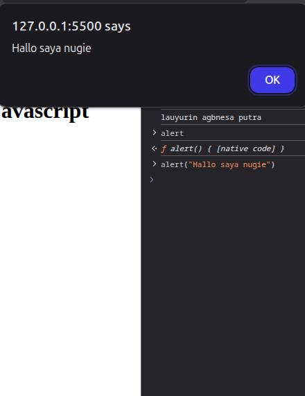

# JAVASCRIPT DASAR
javascript merupakan bahasa pemograman yang di mana engine nya sudah berada di browser 

## MENJALANKAN JAVASCRIPT BISA DENGAN 4 CARA
1. Menjalankan javascipt dari browser
2. Menjalankan javascript menggunakan inline javascript
3. Menjalankan javascript menggunakan tag script
4. Menjalankan javascript menggunakan external javascript

### CONTOH MENJALANKAN JAVSCRIPT 
1. Menjalankan javascript dari browser <br>
dapat di lihat di gambar bawah ini kita dapat menambahkan script javascript di console browser <br>


2. Menjalankan javascript menggunakan inline javascript <br>
salah satu contoh javascript inline merupakan inline event seperti onclick 
```html 
<li>dapat menjalani javascript di inline : <button onclick="alert('saya di klik')">klik saya</button></li> 
```

3. Menjalankan javascript menggunakan tag script <br>
```js 
   <!-- menggunakan tag script -->
    <script>
        console.log("Menjalankan javscript di tag script");
    </script>
 ```

4. Menjalankan javascript menggunakan external javascript <br>
**Membuat file javascript dengan format .js** <br>
 <br>
**Serta panggil file tersebut di tag script**
```html
<!-- menggunakan external javascript -->
    <script src="script.js"></script>
```
> catatan tambahan : Jika ingin menggunakan tag script harus di pasang di dalam sebelum tutup body


## VARIABEL
di dalam pemograman variabel bisa di bayangkan adalah tempat wadah menyimpan nya suatu data 

### Pembuatan variabel di javascript ada 3 cara
1. var
2. let
3. const

### Var
Var merupakan keyword di javascript yang di gunakan unutk membuat variabel. <br>
variabel yang di buat dengan keyword var akan bersifat global scope bahkan jika **variabel tersebut ada di dalam sebuah local scope**

#### Cara penggunaan
```js
// membuat variabel
var names = "Muhmmad Nadin Nugraha"
// Sifat kelakuan dari var
{
    var names = "Alexandria kurniawati"
    // console yang ini akan menampilkan alexandria kurniawati
    console.log(names)
}
// console yang ini juga akan menampilkan alexandria kurniawati
console.log(names)
```

#### hasil
```
Alexandria kurniawati
Alexandria kurniawati
```
> Catatan : Jika ingin membuat variabel jangan menggunakan var lagi karena sulit unutk di maintenence dan sudah jadul
### Let
Let merupakan sebuah  keyword di javascript yang di gunakan untuk membuat variabel. <br>
variabel yang menggunakna keyword let akan bersifat **lebih di dahulukan local scope daripada global scope** jadi ketika ada variabel di scope maka variabel tersebuat yang akan di gunakan terlebih dahulu

#### Cara penggunaan
```js
// membuat variabel
let nama = "Nugie kurniawan"
// Sifat kelakuan dari let
{
    let nama = "Alexander kurniawan"
    // console yang ini akan menampilkan alexander kurniawan
    console.log(nama);
}
// console yang ini akan menampilkan Nugie kurniawan
console.log(nama)
```
#### Hasil : 
```
Alexander kurniawan
Nugie kurniawan
```
> Catatan : Lebih di rekomendasikan jika membuat varibel menggunakan let di bandingkan Var karena agar mudah di maintenence serta agar tidak menimbulkan error ke depannya

### Const
Const merupakan salah satu dari 3 pembuatan varibel di javascript yang di gunakan untuk menampung nilai constanta(**tidak berubah**)

#### Cara Penggunaan 
```js
const TAHUN = "2004"
console.log(TAHUN)
```

#### Hasil
```
2004
```

> Catatan : Const ini di peruntukan jika data nya tidak akan pernah di ubah ubah jika data nya di tengah program di ubah maka akan menghasilkan error, serta penulisan variabel Const itu biasanya menggunakan huruf besar sebagai penanda bahwa variabel ini merupakan variabel constanta.

## TIPE DATA
Tipe data dalam pemograman merupakan tipe dari values sebuah nilai. <br>
kita bisa mengecek tipe data menggunakan typeof(typeof merupakan sebuah fitur di javascript agar bisa mengecek tipe data yang di gunakan itu tipe data apa)
### Tipe Data dalam javascript ada 4
1. String
2. Number
3. Boolean
4. Undifined

#### String
Tipe data String merupakan tipe data huruf, bisa berbentuk apapun selama ada kutip("")

#### Contoh penggunaan
```js
let string = "Ini adalah string" //ini adalah tipe data string yaitu huruf dengan tanda quotes di atas
console.log(typeof string)
```

#### Hasil
```
string
```
> Catatan : Dalam javascript jika ingin membuat string wajib menggunakan kutip

#### Number
Tipe data number merupakan tipe data yang berisi kumpulan kumpulan angka

#### Contoh penggunaan
```js
let number = 99 // ini adalah tipe data number yaitu tipe data untuk angka
console.log(typeof number)
```

#### Hasil
```
number
```

> Catatan : Dalam javascript membuat tipe data number tidak boleh menggunakan kutip karna jika memakai kutip akan di anggap sebagai string

#### Boolean
Tipe data boolean merupakan tipe data yang berisi hanya 2 nilai yaitu true or false biasanya operasi ini di gunakan dalam perkondisian, pengulangan

#### Cara Penggunaan
```js
let boolean = true // ini adalah tipe data boolean dimana hanya terdapat 2 nilai saja yaitu true dan false
console.log(typeof boolean)
```

#### Hasil
```
boolean
```

> Catatan : Tipe data boolean hanya bisa di isi true or false saja 

#### Undefined
Tipe data undifined merupakan tipe data yang tidak memiliki isi tetapi tetap ada sebagai penanda bahwa variabel tersebut tidak mempunyai data apapun di dalamnya

#### Cara Penggunaan
```js
let undefineds; //ini adalah tipe data undifined dimana artinya variabel tersebut belum mempunyai values atau nilai
console.log(typeof undefineds)
```

#### Hasil
```
undefined
```

> Catatan : tipe data undefined bisa sebagai penanda jika di dalamnya tidak terdapat apa apa serta tipe data undifined berbeda dengan tipe data null

## Operasi Aritmatika
operasi aritmatika adalah operasi matematika dasar yang menjumlahkan antara 2 atau lebih angka
bisa pertambahan, pengurangan, pembagian, perkalian, dan modulus

### Pertambahan(+)
dalam javascript dan kebanyakan bahasa pemograman lainnya untuk operasi pertambahan itu menggunakan tanda plus(+) 

#### Cara Penggunaan
```js
let a = 50
let b = 5

let c = a+b

console.log("Hasil pertambahan dari "+a+" dan "+b+" adalah "+c)
```

#### Hasil
```console
Hasil pertambahan dari 50 dan 5 adalah 55 
```

### Pengurangan(-)
dalam javascript dan kebanyakan bahasa pemograman lainnya untuk operasi pengurangan itu menggunakan tanda min(-)

#### Cara Penggunaan
```js
let a = 50
let b = 5

let c = a-b

console.log("Hasil pengurangan dari "+a+" dan "+b+" adalah "+c)
```

#### Hasil
```console
Hasil pengurangan dari 50 dan 5 adalah 45
```

### Pembagian(/)
dalam javascript dan kebanyakan bahasa pemograman lainnya untuk operasi pembagian itu menggunakan tanda slash(/)

#### Cara Penggunaan
```js
let a = 50
let b = 5

let c = a/b

console.log("Hasil pembagian dari "+a+" dan "+b+" adalah "+c)
```

#### Hasil
```console
Hasil pembagian dari 50 dan 5 adalah 10
```

### Perkalian(*)
dalam javascript dan kebanyakan bahasa pemograman lainnya untuk operasi perkalian itu menggunakan tanda bintang(*)

#### Cara Penggunaan
```js
let a = 50
let b = 5

let c = a*b

console.log("Hasil perkalian dari "+a+" dan "+b+" adalah "+c)
```

#### Hasil
```console
Hasil perkalian dari 50 dan 5 adalah 250
```

### Modulus(%)
Modulus merupakan operasi aritmatika yang akan menghasilkan sisa bagi dan menggunakan tanda persen(%) untuk operasinya

#### Cara Penggunaan
```js
let a = 50
let b = 5

let c = a%b

console.log("Hasil modulus dari "+a+" dan "+b+" adalah "+c)
```

#### Hasil
```console
Hasil modulus dari 50 dan 5 adalah 0
```

> Catatan : Untuk operasi aritmatika ini sama seperti matematika dasar pada umumnya yaitu urutan nya berdasarkan kukabataku(kurung, kali, bagi, tambah, kurang) jadi hirarki nya kurung akan lebih di utamakan terlebih dahulu

## Operasi assigment(penugasan)
Operasi assigment(penugasan) adalah operasi di dalam pemograman yang berfungsi untuk menugaskan apa yang ada di sebalahkanan(operand) ke dalam sebelah kiri(variabel)

**Berikut daftar operator assigment**
    <table border="1" cellspacing="0" cellpadding="6" style="text-align:center; border-collapse:collapse;">
        <thead>
           <tr>
             <th>Operator</th>
            <th>Simbol</th>
            <th>fungsi</th>
           </tr>
        </thead>
        <tbody>
            <tr>
                <td>Sama dengan</td>
                <td>=</td>
                <td>Berfungsi untuk menyimpan nilai yang kanan ke variabel sebalah kiri</td>
            </tr>
            <tr>
                <td>Tambah Sama dengan</td>
                <td>+=</td>
                <td>Berfungsi untuk Manambahkan nilai yang kanan dengan variabel sebalah kiri</td>
            </tr>
            <tr>
                <td>Kurang Sama dengan</td>
                <td>-=</td>
                <td>Berfungsi untuk Mengurangi nilai variabel sebalah kiri dengan nilai yang sebelah kanan</td>
            </tr>
            <tr>
                <td>Bagi Sama dengan</td>
                <td>/=</td>
                <td>Berfungsi untuk Membagi nilai variabel sebalah kiri dengan nilai yang sebelah kanan</td>
            </tr>
            <tr>
                <td>Kali Sama dengan</td>
                <td>*=</td>
                <td>Berfungsi untuk Mengkalikan nilai variabel sebalah kiri dengan nilai yang sebelah kanan</td>
            </tr>
            <tr>
                <td>Modulus Sama dengan</td>
                <td>%=</td>
                <td>Berfungsi untuk sisa bagi dari nilai variabel sebalah kiri dengan nilai yang sebelah kanan</td>
            </tr>
        </tbody>
    </table>

### sama dengan(=)
sama dengan(=) merupakan salah satu operator assigment dimana untuk memasukkan nilai yang ada di sebelah kanan ke dalam variabel yang ada di sebelah kiri

#### Cara penggunaan
```js
let a = 60
console.log(a)
```

#### Hasil
```
60
```

### Tambah sama dengan(+=)
tambah sama dengan(+=) adalah salah satu operasi assigment yang berfungsi untuk menambahkan nilai dari sebalah kanan ke dalam variabel sebelah kiri

#### Cara penggunaan
```js
let a = 60
a+=2
console.log(a)
```

#### Hasil
```console
62
```

### Kurang sama dengan(-=)
Kurang sama dengan(-=) adalah salah satu operasi assigment yang berfungsi untuk Mengurangi nilai dari variabel sebelah kiri dengan nilai sebalah kanan

#### Cara penggunaan
```js
let a = 60
a-=2
console.log(a)
```

#### Hasil
```console
58
```

### Bagi sama dengan(/=)
Bagi sama dengan(/=) adalah salah satu operasi assigment yang berfungsi untuk Membagi nilai dari variabel sebelah kiri dengan nilai sebalah kanan

#### Cara penggunaan
```js
let a = 60
a/=2
console.log(a)
```

#### Hasil
```console
30
```

### Kali sama dengan(*=)
Kali sama dengan(*=) adalah salah satu operasi assigment yang berfungsi untuk Mengkalikan nilai dari variabel sebelah kiri dengan nilai sebalah kanan

#### Cara penggunaan
```js
let a = 60
a*=2
console.log(a)
```

#### Hasil
```console
120
```

### Modulus sama dengan(%=)
Modulus sama dengan(%=) adalah salah satu operasi assigment yang berfungsi untuk hasil sisa bagi  dari variabel sebelah kiri di bagi nilai sebalah kanan

#### Cara penggunaan
```js
let a = 60
a%=2
console.log(a)
```

#### Hasil
```console
0
```
> Catatan : Untuk assigment ini akan memasukkan nilai akhirnya ke dalam variabel yang ada di sebelah kiri

## Operasi Perbandingan
Operasi perbandingan adalah operasi yang membandingkan antara 2 nilai dan akan menghasilkan tipe data boolean true atau false

**Daftar operasi perbandingan**
 <table border="1" cellspacing="0" cellpadding="6" style="text-align:center; border-collapse:collapse;">
        <thead>
            <tr>
                <th>Operasi</th>
                <th>Simbol</th>
                <th>Fungsi</th>
            </tr>
        </thead>
        <tbody>
            <tr>
                <td>Sama dengan(Pembanding)</td>
                <td>==</td>
                <td>Berfungsi untuk membandingkan antar dua nilai apakah memiliki nilai yang sama</td>
            </tr>
            <tr>
                <td>Tidak sama dengan</td>
                <td>!=</td>
                <td>Berfungsi untuk membandingkan antar dua nilai apakah nilai nya tidak sama</td>
            </tr>
            <tr>
                <td>Sama dengan strict</td>
                <td>===</td>
                <td>Berfungsi untuk membandingkan antar dua nilai apakah nilai nya sama namun di bandingkan juga dengan tipe datanya</td>
            </tr>
            <tr>
                <td>Tidak sama dengan strict</td>
                <td>!==</td>
                <td>Berfungsi untuk membandingkan antar dua nilai apakah nilai nya tidak sama namun di bandingkan juga dengan tipe datanya</td>
            </tr>
            <tr>
                <td>Lebih besar dari</td>
                <td>></td>
                <td>Berfungsi untuk membandingkan antar dua nilai apakah nilai yang ada di sebelah kiri lebih besar dari nilai yang ada di sebelah kanan</td>
            </tr>
            <tr>
                <td>Lebih kecil dari</td>
                <td><</td>
                <td>Berfungsi untuk membandingkan antar dua nilai apakah nilai yang ada di sebelah kiri itu lebih kecil dari nilai yang ada di sebalah kanan </td>
            </tr>
            <tr>
                <td>Lebih besar atau sama dengan</td>
                <td>>=</td>
                <td>Berfungsi untuk membandingkan antar dua nilai apakah nilai yang ada di sebelah kiri itu lebih besar atau sama dengan nilai yang ada di sebalah kanan </td>
            </tr>
            <tr>
                <td>Lebih kecil atau sama dengan</td>
                <td><=</td>
                <td>Berfungsi untuk membandingkan antar dua nilai apakah nilai yang ada di sebelah kiri itu lebih kecil atau sama dengan nilai yang ada di sebelah kanan</td>
            </tr>
        </tbody>
    </table>

### Sama dengan (Pembanding)
Sama dengan(Pembanding) merupakan salah satu operator pembanding dimana membandingkan antar 2 nilai apakah memiliki nilai yang sama dan sama dengan ini berbeda dengan sama dengan di operator assigment

#### Cara penggunaan
```js
let a = 5
let b = 5

console.log(a==b)
```

#### Hasil
```console
true
```

> Catatan : Hati hati jika menggunakan ini maka akan membandingkan bahkan jika angka tersebut adalah sebuah string akan menghasilkan true, dan operator sama dengan(pemabanding) akan menghasilkan true jika kedua nilai memiliki nilai yang sama

### Tidak sama dengan
Tidak sama dengan merupakan salah satu operator pembanding dimana membandingkan antar 2 nilai apakah memiliki nilai yang tidak sama.

#### Cara Penggunaan
```js
let a=5
let b=5

console.log(a!=b)
```

#### Hasil
```console
false
```

> Catatan : sama dengan sama dengan hati hati jika menggunakan ini akan membandingkan bahkan jika angka tersebut sebuah string akan tetap di bandingkan, dan operator tidak sama dengan akan menghasilkan true jika kedua nilai nya tidak sama

### Sama dengan Strict
Sama dengan Strict merupakan salah satu operator pembanding dimana membandingkan antar 2 nilai apakah memiliki nilai yang sama serta akan membandingkan tipe data nya juga

#### Cara penggunaan
```js
let a = 5
let b = 5

console.log(a===b)
```

#### Hasil
```console
true
```

> Catatan : operator sama dengan Strict akan menghasilkan true jika kedua nilai memiliki nilai yang sama serta jika tipe datanya pun sama juga

### Tidak sama dengan strict
Tidak sama dengan strict merupakan salah satu operator pembanding dimana membandingkan antar 2 nilai apakah memiliki nilai yang tidak sama dan akan membandingkan tipe datanya juga

#### Cara Penggunaan
```js
let a=5
let b=5

console.log(a!==b)
```

#### Hasil
```console
false
```

> Catatan : operator tidak sama dengan akan menghasilkan true jika kedua nilai nya tidak sama serta jika tipe data nya pun sama juga

### Lebih besar dari
Lebih besar dari merupakan salah satu operator pembanding dimana membandingkan antar 2 nilai apakah Nilai yang ada di sebelah kiri lebih besar dari nilai yang ada di sebelah kanan

#### Cara Penggunaan
```js
let a=5
let b=5

console.log(a>b)
```

#### Hasil
```console
false
```

> Catatan : Operator lebih besar dari akan menghasilkan true jika nilai yang ada di sebelah kirinya lebih besar dari nilai yang ada di sebelah kanan

### Lebih kecil dari
Lebih kecil dari merupakan salah satu operator pembanding dimana membandingkan antar 2 nilai apakah Nilai yang ada di sebelah kiri lebih kecil dari nilai yang ada di sebelah kanan

#### Cara Penggunaan
```js
let a=4
let b=5

console.log(a<b)
```

#### Hasil
```console
true
```

> Catatan : Operator lebih kecil dari akan menghasilkan true jika nilai yang ada di sebelah kirinya lebih kecil dari nilai yang ada di sebelah kanan

### Lebih kecil dari atau sama dengan
Lebih kecil dari atau sama dengan merupakan salah satu operator pembanding dimana membandingkan antar 2 nilai apakah Nilai yang ada di sebelah kiri lebih kecil dari atau sama dengan nilai yang ada di sebelah kanan

#### Cara Penggunaan
```js
let a=4
let b=5

console.log(a<=b)
```

#### Hasil
```console
true
```

> Catatan : Operator lebih kecil dari akan menghasilkan true jika nilai yang ada di sebelah kirinya lebih kecil dari atau sama dengan nilai yang ada di sebelah kanan

### Lebih besar dari atau sama dengan
Lebih besar dari atau sama dengan merupakan salah satu operator pembanding dimana membandingkan antar 2 nilai apakah Nilai yang ada di sebelah kiri lebih besar dari atau sama dengan nilai yang ada di sebelah kanan

#### Cara Penggunaan
```js
let a=4
let b=5

console.log(a>=b)
```

#### Hasil
```console
false
```

> Catatan : Operator lebih besar dari akan menghasilkan true jika nilai yang ada di sebelah kirinya lebih besar dari atau sama dengan nilai yang ada di sebelah kanan


## Operasi logika
operasi logika merupakan operasi yang membandingkan 1 atau 2 lebih tipe data boolean<br>
**daftar operator logika**
<table>
        <thead>
            <tr>
                <th>operator</th>
                <th>simbol</th>
                <th>fungsi</th>
            </tr>
        </thead>
        <tbody>
            <tr>
                <td>AND</td>
                <td>&&</td>
                <td>Akan bernilai true jika kedua sisinya true</td>
            </tr>
            <tr>
                <td>OR</td>
                <td>||</td>
                <td>Akan bernilai true jika Minimal salah satu sisinya true</td>
            </tr>
            <tr>
                <td>NOT</td>
                <td>!</td>
                <td>Akan menghasilkan boolean yang terbalik</td>
            </tr>
        </tbody>
</table>

### And(&&)
And merupakan operator logika yang akan menghasilkan nilai boolean, dan akan menghasilkan nilai true jika kedua sisinya bernilai true

#### Cara pengunaan
```js
console.log(10>5 && 11 < 20)
```

#### Hasil
```
true
```

### Or(||)
OR merupakan operator logika yang akan menghasilkan nilai boolean, dan akan menghasilkan nilai true jika minimal salah satu dari 2 nilai tersebut adalah true

#### Cara pengunaan
```js
console.log(10>5 || 11 > 20)
```

#### Hasil
```
true
```

### Not(!)
Not merupakan operator logika yang akan membalikan nilai boolean, jika nilai tersebut true akan menjadi false, dan jika nilai terebut false akan menjadi true

#### Cara pengunaan
```js
let a = 8
console.log(!((a%2 === 0)))
```

#### Hasil
```
false
```

## Operator kondisional
operator kondisional merupakan operator yang di gunaakan untuk menghasilkan system yang dinamis sesuai kondisi, salah satu contohnya adalah operator ternary yang merupakan bentuk singkat dari if dan else

### Operator ternary
operator ternary itu termasuk ke dalam operator kondisional dimana akan mengecek kondisinya bernilai true atau belum jika true baru akan mengambil nilai yang ada di sebelah kiri dan jika false akan mengmbil nilai sebelah kanan

#### Cara penggunaan
```js
let angka = 8
let hasil = (angka%2 === 0) ? "genap" : "ganjil"
console.log(hasil)
```

#### Hasil
```
genap
```

> Catatan : Jika mau lebih dari 1 kondisi maka anda bisa menggunakan if else, atau switch case